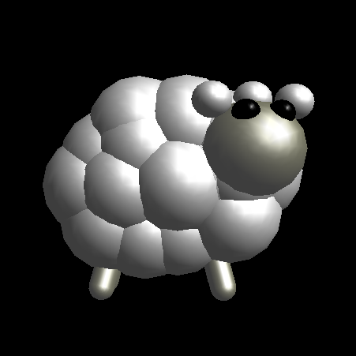

# Stado 🐑
Da li možete da sačuvate sve ovce i dovedete ih kući žive? 🐑 Cilj igre je zagraditi sve ratrčane ovce (u što manji prostor). Požurite dok ne padne noć!

## 🎲 Pravila igre

* Igra se može igrati u 5 nivoa i sa do 5 ovaca. Na samom početku izvršavanja programa od korisnika će se tražiti da na standardnom ulazu unese željeni nivo i broj ovaca.

* Partija podrazumevano traje 75 sekundi. Za to vreme bi trebalo ovce zatvoriti u prostor veličine od 5 do 10% (zavisi od nivoa) od ukupne površine terena po ovci.

* Kosom igrač isctrava putanju po kojoj će zagraditi ovce. Sve one moraju biti unutar pravougaone oblasti ograničene tom linijom i   postojećim zidovima terena. Ukoliko ovca pređe preko putanje dok još nije iscrtana, poništava se cela.

* Ako igrač za vreme iscrtavanja pređe kosom direktno iznad ovce, smatra se da ju je udario i time gubi kompletnu partiju. Putanja se poništava ako igrač promeni smer kretanja kose u sred iscrtavanja. Ovim može da spasi partiju ukoliko u toku iscrtavanja vidi da je sudar sa nekom ovčicom neizbežan.

* Putanje se, osim prelaskom celom dužinom ili širinom mogu crtati i sa jednim ili dva skretanja, ako i takve putanje zajedno sa postojećim zidovima čine pravougaonu oblast u kojoj su sve ovce. Ovo je čak i poželjno, i ovakvi brzi i dovitljivi potezi se dodatno nagrađuju.

* Vodite računa o vremenu! Posebno se pazite kada ste na koji procenat od ciljog zatvaranja ovaca, tu je sve jako blizu i za čas se neprimetno nagazi ovca.

     ####                  Komande za igru i upravljanje kosom
 
 
| Komanda | Šta radi |
----------|-----------
|  `↑`  ,  `↓`  ,  `←`  ,  `→`   |   Pokretanje kose u različitim pravcima |
| `space` | Kada ga kliknemo time označavamo početak iscrtavanja.  Radiće ako se kosa nalazi **na ivici** otvorenog dela terena. |
| `p`     | Igra se pauzira. Klikom na isti taster se i vraćamo u igru. |
| `esc`   | Igra se napušta.(bez obzira na ishod)  Esc svakako treba kliknuti kad se uspešno završi partija da bi se izašlo iz igre. |
 
 

## :cd: Tehnički preduslovi

Igrica je pravljena za Linux operativne sisteme.
Da bi igrica mogla da se pokrene, neophodno je da se instalira OpenGL i glut.
Makefile za prevođenje izvornog koda se nalazi u `src` direktorijumu.
 
 
 

🐑🐑🐑🐑🐑 *Želimo Vam sjajnu zabavu uz naše ovčice!* 🐑🐑🐑🐑🐑
